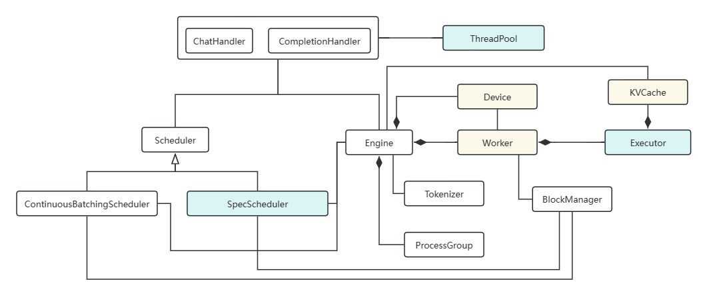
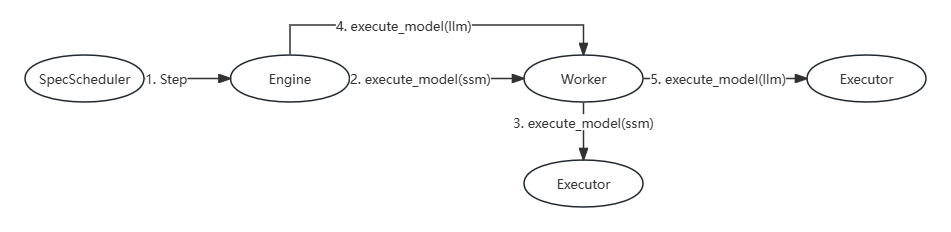

# Speculative Decoding 
## Introduction

Using a small model (draft model) to generate an output token sequence of a certain length k for multiple steps, the generated output token sequence of length k is handed over to the large model for verification, and when the large model verifies the length c, the small model will continue to predict the next output token sequence of length k with the length of input+c for multiple rounds. By using the Spec method, the resource utilization and inference efficiency of large models can be greatly improved.

## Objective

Support speculative decoding by introduce LLM and it's SSM, and in the future, we need to support multiple SSMs.

## Architecture

The architecture of the ScaleLLM is shown in the following figure (some non-related speculative decoding are not shown):

The speculative decoding architecture is as follows:

## Class Description

- SpecScheduler: responsible for the scheduling of speculative decoding, including the scheduling and execution strategy of small models (continuous execution of multiple steps) and the scheduling execution strategy of large models (1 validation step for each round)

- ThreadPool: used to replace the original Executor class

- Executor: The original Executor has been changed, and the existing Executor is designed as an execution entry instead of the Schedule function of the ThreadPool. Each worker contains multiple executors, and each executor corresponds to a model (small or large)

- Worker: The functions executed by a worker are extracted into the Executor.

- KVCache: Support multiple std::vectors<KVCache> in worker, and each executor have an independent std::vector<KVCache>.

- Device: For SSMs and LLM share same device, and also share CudaContext and CudaStream, etc., and enable MPS

## Speculative Decoding Process

The following figure shows the speculative decoding process:

1. SpecScheduler executes Step (block when there is no request), gets batch requests from the request pool (SSM)

2. According to step configuration, call Engine->execute_model(ssm) in the SpecScheduler k times, and ssm indicate execute SSM in worker.

3. The worker calls the Executor->run to execute SSM. (each model has its own Executor)

4. After small model is executed in k steps, Engine->execute_model (llm) is called in the SpecScheduler, and llm indicate execute LLM worker.

5. The Worker calls the Executor->run to execute LLM.

