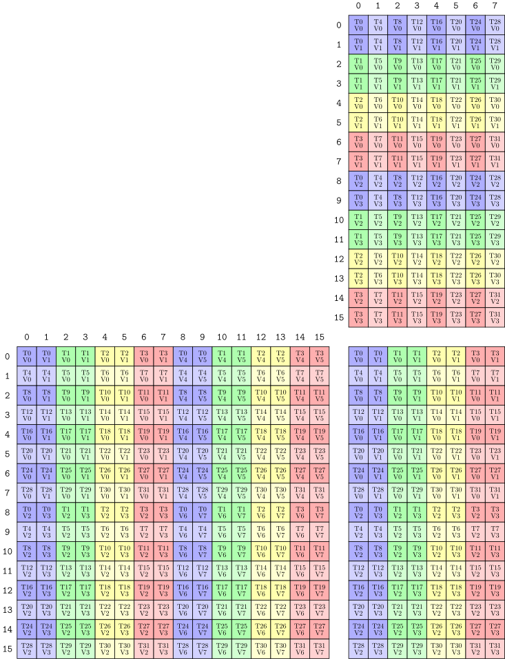

Playground to help learn and experiment with the kernel code. 

# Overview

## CUTE
* local_tile
* local_partition
* tiled_mma
* tiled_copy
* swizzle
* TMA

## GEMM fusion
* layout conformance
* async WGEMM


# HowTo
## Visualization
The `cute::print_latex` function generates LaTeX that can be compiled with `pdflatex` into a color-coded vector graphics image of the same 2-D table. This works for 'Layout', 'TiledMMA', 'TiledCopy', which is super helpful for understanding the layout and partitioning patterns within Cute.

For example:

1> use the following c++ code to generate the LaTeX code for the MMA tensor:
```cpp
  MMA_Atom mma = MMA_Atom<SM80_16x8x16_F32F16F16F32_TN>;
  print_latex(mma);
```
2> copy the generated LaTeX code to a file named `mma.tex`

3> run `pdflatex -shell-escape mma.tex` to generate `mma.pdf`

4> run `pdf2svg mma.pdf mma.svg` to convert the pdf to svg (optionally)
<p align="center">
  
</p>

### Install pdflatex
PdfLatex is a tool that converts Latex sources into PDF. You can install it on Ubuntu using the following commands.
```bash
# install texlive
sudo apt-get install texlive-latex-base

# install fonts (optional)
sudo apt-get install texlive-fonts-recommended
sudo apt-get install texlive-fonts-extra

# install extra packages
sudo apt-get install texlive-latex-extra
```

Once installed, you can compile the LaTeX code into a PDF file using the following command.
```bash
pdflatex mma.tex
```

### Install pdf2svg
Pdf2svg is a tool that converts PDF files into SVG. You can install it on Ubuntu using the following commands.
```bash
sudo apt-get install -y pdf2svg
```